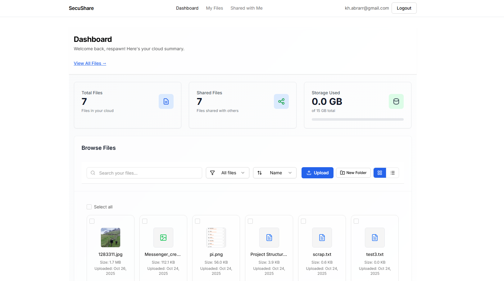

# 🔐 SecureShare – File Sharing Platform



SecureShare is a **privacy-first, end-to-end encrypted file-sharing web application** that allows users to securely upload, share, and download files with fine-grained access control. The platform supports password-protected and expiring links, ensuring total control over how your files are shared.

🔗 **Live Demo:** [https://secu-share-two.vercel.app/](https://secu-share-two.vercel.app/)  

---

## 🚀 Features

### ✅ Core Functionalities

#### 🔒 Authentication
- JWT-based signup/login system using email and password.
- Secure password hashing with `bcrypt`.
- Authenticated routes with middleware protection (`/api/auth/me`).

#### ☁️ File Upload & Storage
- Authenticated users can upload and manage files.
- Files securely stored on **AWS S3** using pre-signed URLs.
- Organized folder structure for better file management.

#### 🔗 Secure Sharing
- Generate shareable download links with:
  - Optional **expiry time**
  - **Access control** (public or specific users only)
  - **Password-protected sharing** for additional security
  - One-time or unlimited access modes

#### 👥 Access Control
- Share files publicly, privately, or with selected users.
- Only authorized users can view or download private files.
- File access logged and verified via JWT validation.

#### 🧭 Dashboard & File Management
- Modern, responsive dashboard with:
  - Total and shared file counts
  - Storage usage tracking
  - File search, sorting, and filtering
- Support for images, documents, and text previews
- Folder creation and structured browsing

---

## 🧰 Tech Stack

| Layer | Technology |
|-------|-------------|
| **Frontend** | React.js, Tailwind CSS |
| **Backend** | Node.js, Express.js |
| **Database** | MongoDB (Mongoose ODM) |
| **Storage** | AWS S3 (Pre-signed URLs) |
| **Authentication** | JWT, bcrypt |
| **Deployment** | Backend: AWS EC2 (Nginx + PM2) <br> Frontend: Vercel |

---

## ⚙️ Installation Guide

### 1️⃣ Clone the Repository
```bash
git clone https://github.com/kh-abrar/SecureShare.git
cd SecureShare
2️⃣ Backend Setup
bash
Copy code
cd backend
npm install
Create .env file:
env
Copy code
PORT=5000
MONGO_URI=your_mongodb_connection_string
JWT_SECRET=your_jwt_secret
AWS_ACCESS_KEY_ID=your_aws_key
AWS_SECRET_ACCESS_KEY=your_aws_secret
AWS_REGION=your_region
S3_BUCKET_NAME=your_bucket_name
Run the server:
bash
Copy code
npm start
Backend will be available at http://localhost:5000

3️⃣ Frontend Setup
bash
Copy code
cd frontend
npm install
npm run dev
Frontend will be available at http://localhost:5173

🔧 Deployment Overview
Backend deployed on AWS EC2 using:

Nginx as reverse proxy for HTTPS and routing

PM2 for Node.js process management

Frontend deployed on Vercel

MongoDB Atlas for cloud database

AWS S3 for secure file storage

🧩 API Endpoints Overview
Method	Endpoint	Description
POST	/api/auth/register	User signup
POST	/api/auth/login	User login
GET	/api/auth/me	Get current user info
POST	/api/files/upload	Upload file
GET	/api/files	List user files
POST	/api/share/create	Create share link
POST	/api/share/protected	Create password-protected share link
GET	/api/share/access/:token	Access shared file
DELETE	/api/share/delete/:token	Delete shared link

🧱 Folder Structure
arduino
Copy code
SecureShare/
├── backend/
│   ├── controllers/
│   ├── middlewares/
│   ├── models/
│   ├── routes/
│   ├── utils/
│   └── server.js
├── frontend/
│   ├── src/
│   │   ├── components/
│   │   ├── pages/
│   │   ├── hooks/
│   │   ├── utils/
│   │   └── App.jsx
│   └── vite.config.js
└── README.md
🛡️ Security Highlights
End-to-end encryption for file transmission.

All credentials hashed using bcrypt.

JWT-based authentication for all protected routes.

Pre-signed S3 URLs for secure, time-limited access.

Password-protected links for sensitive files.

Strict CORS and HTTPS enforcement via Nginx.

📸 UI Overview
Dashboard: File summary, usage stats, upload & folder management.

My Files: Manage files (rename, move, delete, share).

Shared With Me: View files shared by other users.

Share Modal: Configure password & expiry settings for links.
